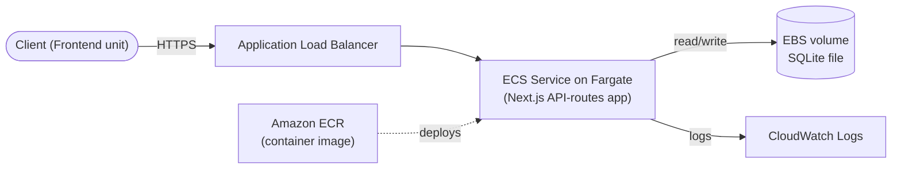

# Deployment Architecture — Backend unit

## Diagram



### Text Alternative

```
Client (Frontend unit)
   --(HTTPS)-->
Application Load Balancer
   -->
ECS Service on Fargate (Next.js API-routes app)
   --(read/write)--> EBS volume (SQLite file)
   --(logs)-->       CloudWatch Logs

Amazon ECR (container image) --(deploys)--> ECS Service
```

## CloudFormation Stack Scope
This unit gets its own CloudFormation stack (per Question 2), containing:
- VPC networking resources needed for the ALB + ECS service (or references to shared networking, if a shared VPC is used — to be confirmed at Code Generation time)
- ECS cluster, service, and task definition
- ECR repository for the container image
- EBS volume / persistent storage configuration for the Fargate task
- Application Load Balancer + listener + target group
- CloudWatch Log Group

The Frontend unit's stack is separate and references this stack's ALB endpoint (or a stable DNS name) as its API base URL — the exact cross-stack reference mechanism (CloudFormation exports, SSM Parameter Store, or manual config) is a Code Generation-level detail.

## Deployment Flow
1. Build the Next.js API-routes app into a container image
2. Push the image to Amazon ECR
3. CloudFormation stack (Backend unit) provisions/updates the ECS service to run the new image
4. ECS service becomes reachable via the ALB (fully open, no access control)
