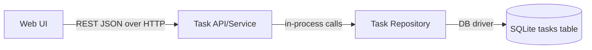

# Component Dependency — 01-task-manager

## Dependency Matrix

| Component | Depends On | Communication Pattern |
|---|---|---|
| Web UI | Task API/Service | REST JSON over HTTP |
| Task API/Service | Task Repository | In-process method calls |
| Task Repository | SQLite database file | Direct DB driver calls |

No circular dependencies. Strictly layered: Web UI → Task API/Service → Task Repository → SQLite.

## Dependency Diagram



### Text Alternative

```
Web UI  --(REST JSON / HTTP)-->  Task API/Service  --(in-process calls)-->  Task Repository  --(DB driver)-->  SQLite tasks table
```

## Data Flow: Add Task

1. User fills in the title and submits the form (Web UI)
2. Web UI does a client-side blank-title check (UX convenience only)
3. Web UI sends `POST /tasks { title }` to Task API/Service
4. Task API/Service validates the title (mandatory check)
   - If blank: returns `400 { error }`, Web UI displays the error, no task created
   - If valid: calls `Task Repository.createTask(title)`
5. Task Repository inserts a row into the SQLite `tasks` table (`completed = false`) and returns the created `Task`
6. Task API/Service returns `201 { task }`
7. Web UI refreshes the task list

## Data Flow: View Task List

1. Web UI loads and sends `GET /tasks` to Task API/Service
2. Task API/Service calls `Task Repository.getAllTasks()`
3. Task Repository selects all rows from the SQLite `tasks` table
4. Task API/Service returns `200 { tasks }` (empty array if none)
5. Web UI renders each task's title + completed status, or an empty-state message if `tasks` is empty
