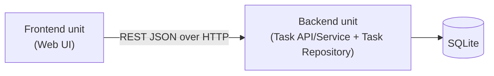

# Unit of Work Dependency — 01-task-manager

## Dependency Matrix

| Unit | Depends On | Integration Pattern |
|---|---|---|
| Frontend | Backend | REST JSON over HTTP (matches `component-dependency.md`) |
| Backend | (none — depends only on its own SQLite storage) | N/A |

No circular dependencies between units.

## Diagram



### Text Alternative

```
Frontend unit  --(REST JSON / HTTP)-->  Backend unit  -->  SQLite
```

## Update / Build Sequence

Since the Frontend unit depends on the Backend unit's API contract:

1. **Backend unit first** — establishes the API contract (`POST /tasks`, `GET /tasks`) and persistence.
2. **Frontend unit second** — implemented against the Backend unit's contract.

No parallelization benefit given the hard dependency and small scope (2 units, 2 features); sequential build keeps the API contract stable before the UI consumes it.
