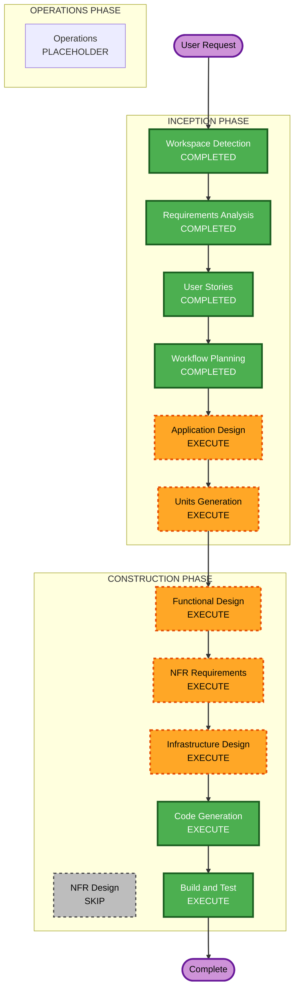

# Execution Plan — 01-task-manager

## Detailed Analysis Summary

### Change Impact Assessment
- **User-facing changes**: Yes — the entire application is a new browser-based UI (add task, view task list)
- **Structural changes**: No — greenfield project, no existing structure to change
- **Data model changes**: Yes — new `Task` model (title, completed status)
- **API changes**: Yes — new endpoints needed to add a task and list tasks
- **NFR impact**: Minimal — persistence (SQLite) already decided in requirements; a web framework/tech stack still needs to be selected
- **Deployment target**: AWS, provisioned via CloudFormation (user-specified)

### Risk Assessment
- **Risk Level**: Low
- **Rollback Complexity**: Easy (greenfield, no production data, no existing users)
- **Testing Complexity**: Simple (2 features, narrow acceptance criteria already defined in stories.md)

## Workflow Visualization



### Text Alternative

```
INCEPTION PHASE
- Workspace Detection      COMPLETED
- Requirements Analysis    COMPLETED
- User Stories             COMPLETED
- Workflow Planning        COMPLETED (this stage)
- Application Design       EXECUTE
- Units Generation         EXECUTE

CONSTRUCTION PHASE (per unit)
- Functional Design        EXECUTE
- NFR Requirements         EXECUTE
- NFR Design               SKIP
- Infrastructure Design    EXECUTE
- Code Generation          EXECUTE (always)

CONSTRUCTION PHASE (after all units)
- Build and Test           EXECUTE (always)

OPERATIONS PHASE
- Operations                PLACEHOLDER
```

## Phases to Execute

### INCEPTION PHASE
- [x] Workspace Detection (COMPLETED)
- [x] Requirements Analysis (COMPLETED)
- [x] User Stories (COMPLETED)
- [x] Workflow Planning (IN PROGRESS — this document)
- [ ] Application Design - EXECUTE
  - **Rationale**: New components needed — a browser-based UI, a backend API service, and a SQLite data access layer. Method contracts (e.g., add task, list tasks) need definition before code generation.
- [ ] Units Generation - EXECUTE
  - **Rationale**: New data model (Task) and new API endpoints span more than one package (frontend UI + backend API). Decomposing into units gives Code Generation a structured, unambiguous target.

### CONSTRUCTION PHASE
- [ ] Functional Design - EXECUTE
  - **Rationale**: New `Task` data model needs schema definition (fields, defaults, validation for blank titles) before implementation.
- [ ] NFR Requirements - EXECUTE
  - **Rationale**: Persistence (SQLite) is already decided, but the web framework / tech stack for frontend and backend has not been selected yet — this stage will make that selection. Security, Resiliency, and Property-Based Testing extensions remain opted out per requirements.md.
- [ ] NFR Design - SKIP
  - **Rationale**: No security/resiliency/performance patterns to design — those extensions are opted out and no performance/scalability requirements were raised. Tech stack selection is fully captured in NFR Requirements.
- [ ] Infrastructure Design - EXECUTE
  - **Rationale**: User specified deployment to AWS, provisioned via CloudFormation — cloud resources (compute, SQLite storage volume, networking) need mapping and IaC templates need to be produced.
- [ ] Code Generation - EXECUTE (ALWAYS)
  - **Rationale**: Implementation planning and code generation needed for both units.
- [ ] Build and Test - EXECUTE (ALWAYS)
  - **Rationale**: Build, test, and verification needed against the acceptance criteria in stories.md.

### OPERATIONS PHASE
- [ ] Operations - PLACEHOLDER
  - **Rationale**: Future deployment and monitoring workflows (out of scope for this iteration).

## Estimated Timeline
- **Total Stages to Execute**: 8 (Application Design, Units Generation, Functional Design, NFR Requirements, Infrastructure Design, Code Generation, Build and Test — plus this Workflow Planning stage)
- **Estimated Duration**: Single-session, low-complexity build (small greenfield app, 2 features)

## Success Criteria
- **Primary Goal**: A working web app where a user can add a task (title) and view the task list, persisted in SQLite, deployable to AWS via CloudFormation.
- **Key Deliverables**: Application design, unit breakdown, generated frontend + backend code, CloudFormation templates, passing tests against stories.md acceptance criteria.
- **Quality Gates**: All acceptance criteria in `aidlc-docs/inception/user-stories/stories.md` pass; build and test instructions execute cleanly; CloudFormation templates are valid.
